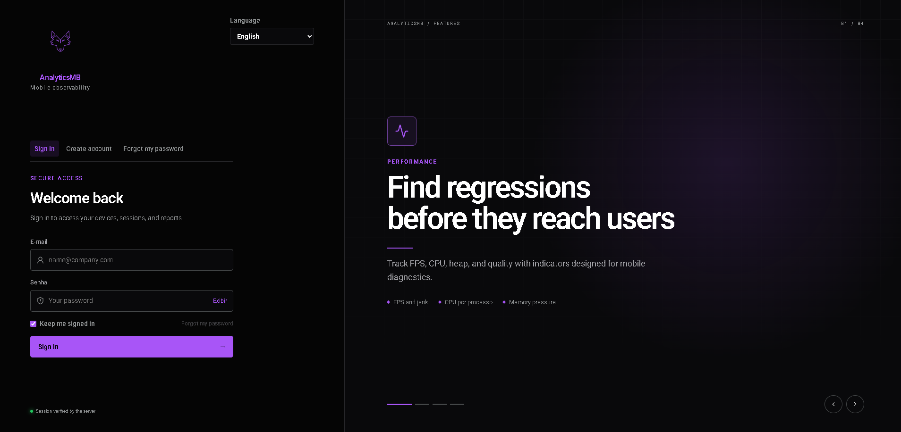

# AnalyticsMB

**Android Performance & QA Diagnostics Platform.**

[](RELEASE.md)
[](docs/DISTRIBUTION.md)
[](docs/ARCHITECTURE.md)
[](LICENSE)



AnalyticsMB é uma plataforma desktop local-first para observabilidade Android, diagnóstico de performance e automação de QA. Ela reúne telemetria via ADB, execução de testes Maestro, sessões históricas, relatórios técnicos e ferramentas de dispositivo em um único workspace.

> **Maestro reproduz o comportamento. AnalyticsMB mede o impacto.**

## Por que o AnalyticsMB existe?

Investigar performance Android normalmente exige alternar entre `adb`, `dumpsys`, `gfxinfo`, `meminfo`, `logcat`, Maestro, scrcpy, bancos locais e scripts próprios. O AnalyticsMB sincroniza esses sinais em sessões estruturadas para reduzir trabalho manual e preservar evidências técnicas.

## Capacidades principais

- diagnóstico local sem SDK obrigatório para as métricas fundamentais;
- CPU, memória, FPS, jank, energia, bateria, rede e estabilidade;
- execução de flows Maestro acompanhada por telemetria contextual;
- histórico de sessões e comparação por pacote, versão e período;
- relatórios técnicos com gráficos, KPIs, evidências e glossário;
- monitoramento de resiliência e ciclo de vida do processo;
- exploração controlada de bancos mobile;
- integração com scrcpy e ferramentas ADB;
- distribuição Windows autocontida e interface multilíngue.

## Para quem foi criado?

- desenvolvedores Android, React Native e .NET MAUI;
- profissionais de QA e automação;
- engenheiros de performance e confiabilidade;
- equipes que investigam regressões, crashes, ANRs e sincronizações interrompidas.

## Como funciona

```text
Developer / QA
      ↓
React + TypeScript
      ↓
API local
      ↓
Serviços de domínio
      ↓
ADB / Android · Maestro · SQLite · scrcpy
```

Os coletores obtêm dados do dispositivo, parsers transformam a saída bruta, calculators normalizam métricas e serviços associam as amostras à sessão correta. O frontend apresenta valores já calculados e mantém indisponibilidade diferente de zero.

Leia a [arquitetura pública](docs/ARCHITECTURE.md) e as [decisões de engenharia](docs/ENGINEERING_DECISIONS.md).

## Início rápido

### Para usar uma release

1. Use Windows 10 ou 11 x64.
2. Garanta uma conexão USB funcional e autorize o computador no Android.
3. Mantenha conexão com a internet para autenticação e conteúdo de idioma.
4. Baixe o instalador na seção [Releases](https://github.com/Erikvilar/analyticsmb-project/releases).
5. Confira o SHA-256 publicado antes de executar.

Consulte [distribuição](docs/DISTRIBUTION.md), [suporte](SUPPORT.md) e [limitações](docs/LIMITATIONS.md).

### Para validar o código demonstrativo

```bash
yarn install
yarn build
yarn test
```

O código disponível em `showcase/` é sanitizado e demonstra contratos tipados, parser, calculator, testes, componentes, hooks, registries e temas. Ele não inicia a aplicação privada.

## Status atual

O produto está em **Beta**. Métricas Android variam conforme versão, fabricante e permissões do dispositivo. Builds beta sem assinatura comercial também podem acionar o SmartScreen.

Veja [RELEASE.md](RELEASE.md), [CHANGELOG.md](CHANGELOG.md) e [ROADMAP.md](ROADMAP.md).

## Documentação

| Documento | Conteúdo |
| --- | --- |
| [Arquitetura](docs/ARCHITECTURE.md) | componentes, fluxo de dados e fronteiras |
| [Decisões de engenharia](docs/ENGINEERING_DECISIONS.md) | contexto, escolhas e trade-offs |
| [Observabilidade](docs/OBSERVABILITY.md) | definição e validade das métricas |
| [Modelo de segurança](docs/SECURITY_MODEL.md) | trust boundaries e minimização de dados |
| [Distribuição](docs/DISTRIBUTION.md) | runtime Windows e verificação de integridade |
| [Limitações](docs/LIMITATIONS.md) | restrições técnicas conhecidas |
| [Retrospectiva](docs/PRODUCT_EVOLUTION.md) | trajetória recente do produto |

## Escopo público

Este repositório é um **showcase profissional**, não o código integral de produção. Ele publica documentação, exemplos arquiteturais e dados sintéticos. Orquestração ADB completa, engine Maestro, repositories e migrations de produção, engine de relatórios, runtime do terminal, autenticação, launcher e instalador permanecem privados.

Não há credenciais, bancos, logs reais, packages internos, serial de dispositivos ou dados de clientes neste repositório.

## Segurança e contribuição

Vulnerabilidades não devem ser abertas como issue pública. Consulte [SECURITY.md](SECURITY.md). Para bugs, propostas e documentação, leia [SUPPORT.md](SUPPORT.md) e [CONTRIBUTING.md](CONTRIBUTING.md).

## Licença

Este repositório é disponibilizado para avaliação técnica e portfólio. Ele **não concede licença open source nem permissão de redistribuição**. Consulte [LICENSE](LICENSE).
