<div align="center">
  

  # AnalyticsMB

  **Estação de observabilidade, diagnóstico e automação de testes para aplicações Android.**

  [](./package.json)
  
  
  
  
  
</div>

## O problema que o projeto resolve

Investigações de performance Android normalmente exigem combinar manualmente `adb`, `dumpsys`, `/proc`, `gfxinfo`, `meminfo`, `logcat`, dados de bateria, conexões de rede, Maestro, scrcpy e bancos locais. Cada ferramenta entrega informações em formatos e momentos diferentes, deixando a evidência fragmentada.

Isso dificulta responder perguntas importantes durante desenvolvimento, QA e investigação de incidentes:

- em que momento a CPU aumentou;
- se a carga veio do dispositivo ou da aplicação monitorada;
- se FPS e jank pioraram no mesmo intervalo;
- quanto de memória e energia foi consumido;
- se o processo foi encerrado ou recriado pelo Android;
- se houve crash ou ANR durante uma jornada automatizada;
- se uma versão regrediu em comparação com outra;
- como preservar os dados para análise e relatório posteriores.

O AnalyticsMB centraliza esses sinais em uma estação desktop e os organiza como telemetria temporal sincronizada. A coleta principal ocorre externamente por ADB, sem exigir um SDK dentro do APK monitorado. Métricas ausentes permanecem indisponíveis em vez de serem convertidas artificialmente em zero, e correlação temporal não é apresentada automaticamente como causalidade.

## Recursos

- Performance: FPS, jank, CPU, memória, pressão de heap e qualidade geral.
- Estabilidade: logs, crashes e ANRs com filtros por período e exportação.
- Dispositivo: bateria, temperatura, informações do Android e resiliência de processos em segundo plano.
- Rede: tráfego, sockets e conexões do pacote monitorado.
- Realm: localização, dump, exploração paginada, filtros e consultas em builds depuráveis.
- Histórico: armazenamento SQLite por pacote, versão e sessão de monitoramento.
- Relatórios: comparação entre versões e aplicativos com gráficos e KPIs.
- Testes: execução Maestro associada à captura de telemetria da jornada.
- Terminal: comandos ADB integrados, histórico, ajuda e preenchimento com `Tab`.
- Espelhamento: abertura opcional do scrcpy nativo.

## Arquitetura


```text
Interface React
      │
      ▼
API Express ───── SQLite / sessões / relatórios
      │
      ▼
Comandos → parsers → calculators
      │
      ▼
Dispositivo Android e pacote monitorado
```

| Camada | Tecnologia |
|---|---|
| Interface | React 19, TypeScript, MUI X Charts |
| API e coleta | Node.js 22, Express 5, comandos ADB e parsers TypeScript |
| Persistência | SQLite e exploração de Realm |
| Desktop | Electron/Nativefier e ferramentas nativas Windows |
| Automação | Maestro e scrcpy |

## Exemplo de fluxo real

1. Um QA conecta um dispositivo Android autorizado.
2. O pacote alvo e uma sessão de monitoramento são selecionados.
3. CPU, memória, FPS, jank, energia, rede e estabilidade são observados.
4. Um cenário Maestro reproduz uma jornada real.
5. A telemetria é associada à janela da execução.
6. O desenvolvedor identifica picos, degradações sustentadas ou regressões.
7. A evidência pode ser comparada e preservada em relatório técnico.

## Interface do AnalyticsMB

### Preparação do ambiente

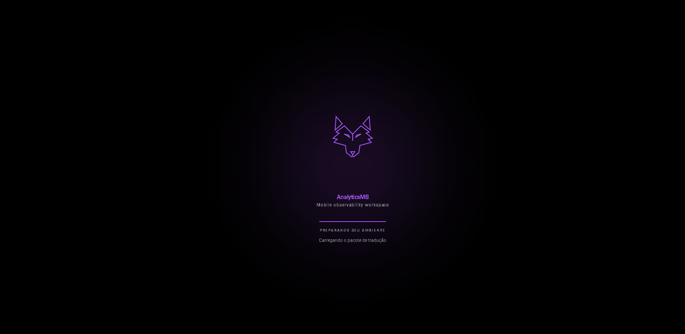

### Autenticação


### Visão geral

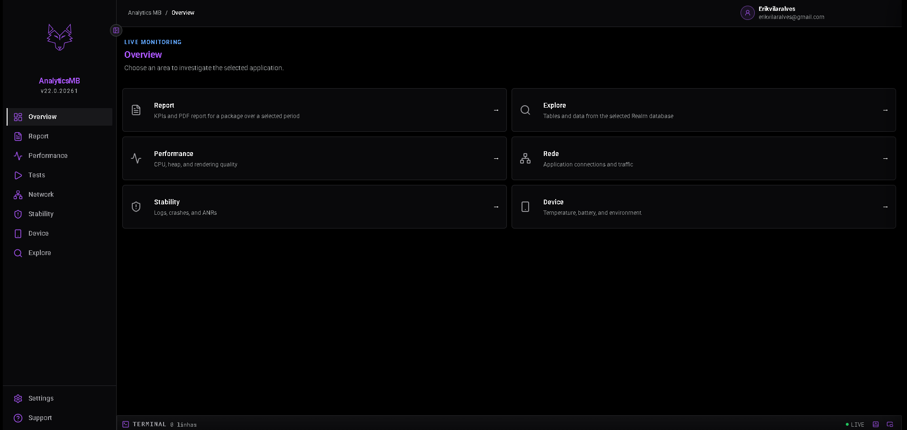

### Informações do dispositivo

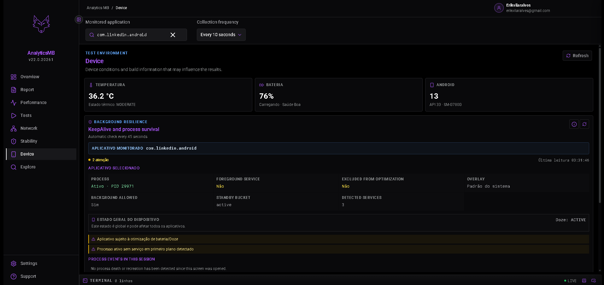

### Performance

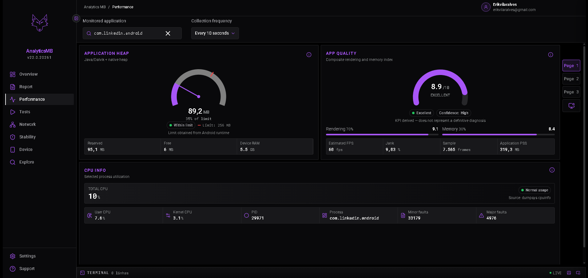

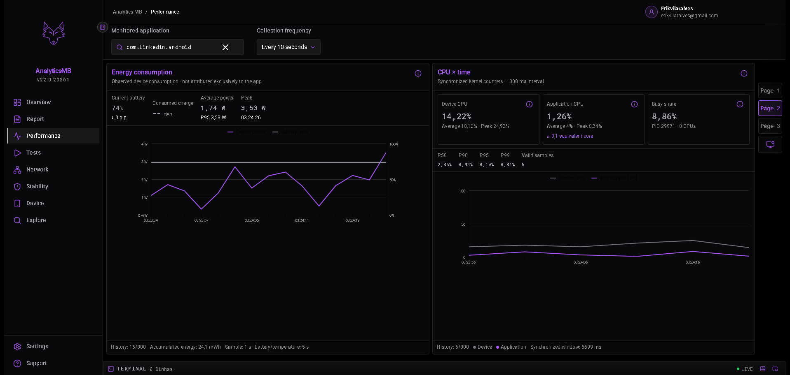

### Rede

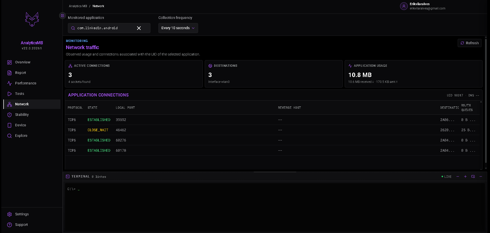

### Estabilidade

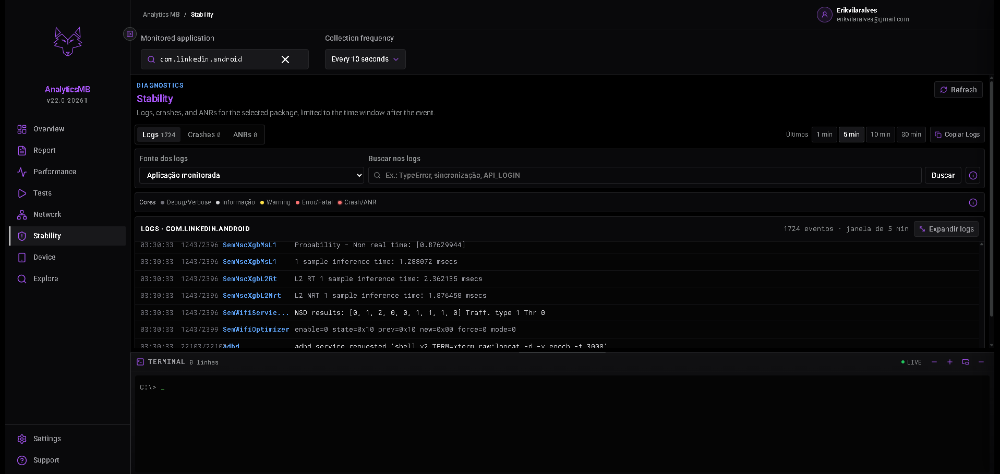

### Testes automatizados

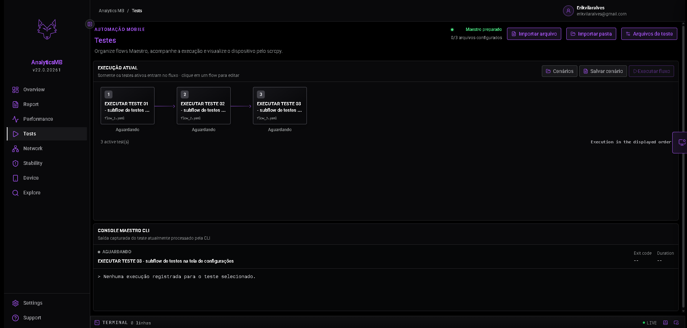

### Relatórios

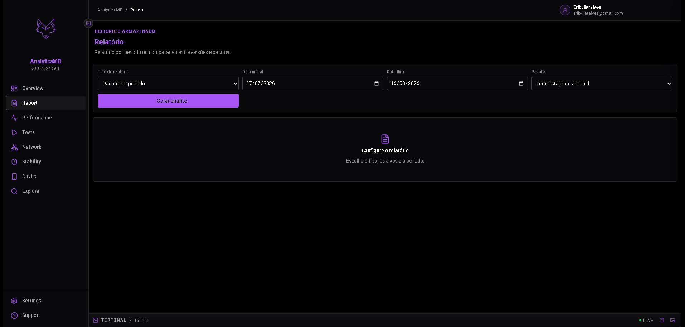

### Configurações e temas

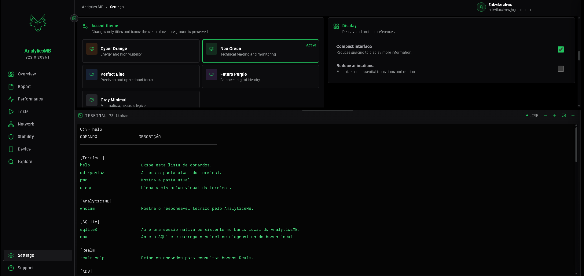

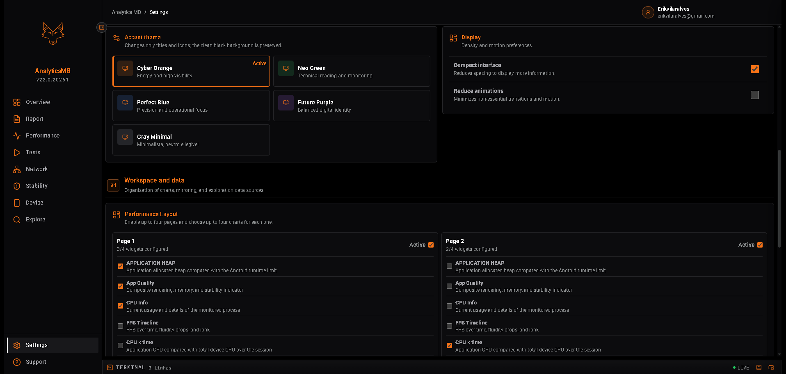

## Conteúdo deste repositório

Este repositório é uma demonstração técnica curada. Ele contém documentação de arquitetura, decisões de engenharia, dados artificiais e exemplos representativos e sanitizados.

A implementação completa de produção permanece privada. Não estão incluídos a orquestração ADB, collectors completos, persistência, execução Maestro, engine de relatórios, terminal, autenticação, launcher, instalador ou configurações de produção.

## Documentação pública

- [Informações da versão pública](./RELEASE.md)
- [Arquitetura](./docs/ARCHITECTURE.md)
- [Decisões de engenharia](./docs/ENGINEERING_DECISIONS.md)
- [Observabilidade Android](./docs/OBSERVABILITY.md)
- [Exemplo backend de CPU](./showcase/backend/cpu-example/README.md)
- [Padrões frontend selecionados](./showcase/frontend/README.md)

## Executar as validações do showcase

Use somente Yarn:

```powershell
yarn install
yarn build
yarn test
```

## Observações

- Os dados demonstrativos são artificiais e usam pacotes fictícios.
- Nenhuma credencial, banco, log real ou binário de ferramenta faz parte do showcase.
- O código apresentado é apenas para portfólio e demonstração.
- Nenhuma licença de redistribuição ou reutilização comercial é concedida sem autorização explícita.

---

Desenvolvido por **Erik Alves Vilar — Software Developer**.
