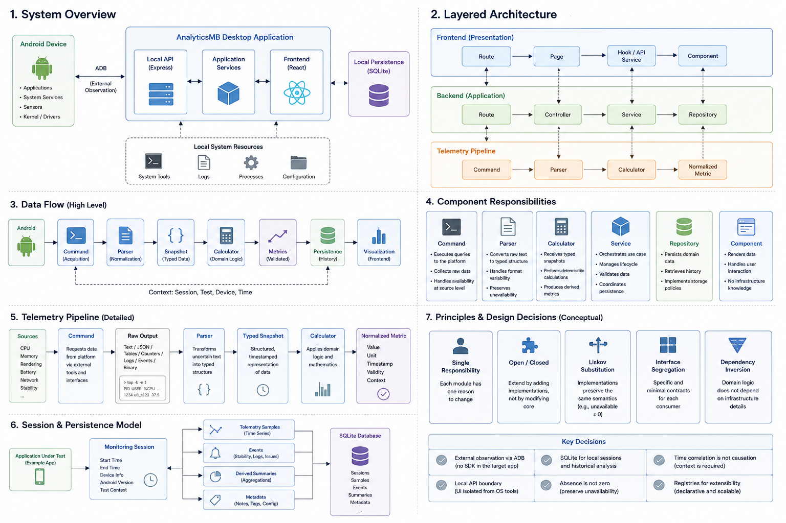

# Arquitetura

## Visão do sistema

O AnalyticsMB é um desktop local-first de observabilidade e QA Android. A aplicação analisada não precisa incorporar um SDK proprietário para os diagnósticos fundamentais.



```text
Developer / QA
      ↓
React + TypeScript
      ↓
API local
      ↓
Application Services
      ↓
Domain Services
      ↓
ADB / Android · Maestro · SQLite · scrcpy
```

## Frontend

Routes selecionam páginas; páginas coordenam hooks; hooks consomem serviços tipados; componentes renderizam e interagem. Navegação, widgets e temas entram por catálogos declarativos, sem condicionais específicas no consumidor.

## API local

A API separa interface e sistema operacional. Controllers tratam HTTP; services orquestram casos de uso; adapters isolam processos externos. Portas e endpoints internos não fazem parte do contrato público deste showcase.

## Pipeline de telemetria

```text
Command → Collector → Parser → Calculator → Service → Repository
```

Commands descrevem a aquisição, collectors controlam a janela, parsers transformam saída incerta, calculators concentram matemática determinística e services associam o resultado à sessão.

## Persistência

Repositories encapsulam SQL e migrations versionadas. Serviços não conhecem statements. Frequência visual e frequência durável são independentes para preservar detalhe útil sem armazenar ruído a cada atualização da tela.

## Sessões

Uma sessão relaciona package, versão, início, última atualização e amostras. Testes Maestro podem abrir uma sessão contextual para que o relatório represente exatamente o intervalo do cenário.

## Runtime e ferramentas externas

ADB, Maestro e scrcpy são dependências externas encapsuladas por adapters. Processos usam argumentos explícitos, timeout e cancelamento da árvore. O runtime distribuído é autocontido, mas os detalhes de launcher e instalação permanecem privados.

## Fluxo de dados

1. O usuário seleciona o alvo ou inicia um cenário.
2. O backend resolve o processo e obtém snapshots próximos no tempo.
3. Parsers validam estrutura e unidade.
4. Calculators produzem métricas normalizadas.
5. A sessão persiste amostras relevantes.
6. A interface e os relatórios consomem contratos prontos.

## Modelo de falha

Processo ausente, mudança de PID, contador reiniciado, timeout ou sensor incompatível geram indisponibilidade explícita. Esses estados não entram como zero em médias e percentis. Uma falha externa não deve bloquear comandos independentes.

## Extensibilidade

```text
Contract → Implementation → Registry
```

Menus, widgets, comandos, métricas, relatórios, temas e fontes de dados devem ser adicionados por extensão. A regra central percorre o contrato e não reconhece individualmente cada implementação.

## Escopo não publicado

O showcase não contém orquestração ADB completa, engine Maestro, repositories e migrations de produção, engine PDF, runtime do terminal, autenticação, launcher, instalador, secrets ou configuração operacional.
